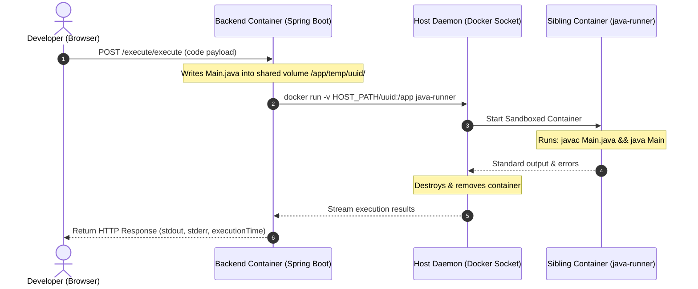

#  Collaborative Code Editor (CBC)

[](https://openjdk.org/)
[](https://spring.io/projects/spring-boot)
[](https://react.dev/)
[](https://www.docker.com/)

A premium, VS Code-inspired real-time collaborative coding workspace. It enables multiple developers to code together with live sync over WebSockets and securely execute Java programs inside a sandboxed Docker container environment.

---

## 📂 Project Directory Structure

```text
cbc/
├── docker-runner/             # Sandboxed Java compiler Docker configurations
│   └── Dockerfile             # Java OpenJDK executor image blueprint
├── frontend/                  # React (Vite) Single Page Application
│   ├── src/
│   │   ├── components/        # Reusable UI containers (ProtectedRoutes)
│   │   ├── context/           # Global AuthContext & Axios Interceptors
│   │   └── pages/             # Auth portal, Dashboard explorer, Workspace page
│   └── Dockerfile             # Multi-stage production build (Node + Nginx)
├── src/                       # Spring Boot Backend API Server
│   └── main/java/com/cbc/
│       ├── config/            # JWT & Security config
│       ├── controller/        # Auth, Room, & Execution API controllers
│       ├── dto/               # Data Transfer Objects
│       ├── entity/            # Hibernate database entity mapping
│       ├── repository/        # Spring Data JPA repositories
│       └── service/           # Core logic (Java sandboxed execution, Rooms)
├── Dockerfile                 # Multi-stage JRE runtime backend image
├── docker-compose.yml         # Network & services orchestration
├── .env.example               # Environment variables template
└── README.md                  # System Documentation
```

---

## 🚀 Key Features

* **Real-time CRDT Collaboration**: Smooth, conflict-free document syncing powered by **Yjs** and **y-monaco**. Transmits optimized base64-encoded binary delta updates instead of string overwrites, preventing cursor jump-backs and resolving concurrency conflicts mathematically.
* **Multi-Runtime Execution Sandboxes**:
  *   **Backend Sandbox (Java)**: Compiles and runs Java code securely inside resource-constrained sibling Docker containers (`128MB RAM / 1 CPU`) using Docker-out-of-Docker (DooD) socket communication.
  *   **Frontend Sandbox (JS, HTML, CSS)**: Natively runs JavaScript code inside an isolated `<iframe>` (secured via `sandbox="allow-scripts"`), intercepting console output via event messages. Compiles and renders HTML/CSS inside an interactive **Live Web Preview** tab.
* **Interactive Console & Preview Panels**: Embedded dark console panel displaying stdout in green, stderr in red, exit codes, and execution times, alongside a live rendering web preview frame.
* **Stateless Authentication**: Protected routes secured by stateless **Spring Security JWT**.
* **Modern Developer UI**: Beautiful VS Code inspired dashboard showing active workspace members, security share codes, and status indicators.

---

## 🏗️ How the Sandboxed Execution Works

When a user selects Java and clicks **Run**:



---

## 📥 Getting Started

### 1. Configure the Environment
Clone the repository and copy the `.env.example` file to create your local `.env` configuration:
* **Linux / macOS:**
  ```bash
  cp .env.example .env
  ```
* **Windows (PowerShell):**
  ```powershell
  copy .env.example .env
  ```

> [!IMPORTANT]  
> Open your `.env` file and update **`EXECUTION_HOST_PATH`** to point to the absolute path of the `temp/` folder on your local Windows/Linux host machine (e.g. `C:/Users/siddh/Downloads/cbc/temp`). Use forward slashes `/` for paths even on Windows.

### 2. Start the Stack (One Command)
Build the Sandboxed Code Runner and launch all services in detached background mode:
```bash
docker compose up --build -d
```

### 3. Access the Application
* **Frontend**: Open [http://localhost](http://localhost) in your browser (served on Nginx Port 80).
* **Backend API Specs (Swagger UI)**: Open [http://localhost:8080/swagger-ui/index.html](http://localhost:8080/swagger-ui/index.html) (enabled for public access in Spring Security).

---

## 🔌 API Endpoints Reference

### 🔐 Authentication (`/auth`)
* `POST /auth/SignUp` - Registers a new user. Accepts JSON: `{ "name", "email", "password" }`.
* `POST /auth/Login` - Authenticates a user. Returns a raw JWT string on success.

### 🏠 Rooms (`/room`)
* `POST /room/create` - Creates a new room. Accepts JSON: `{ "roomName" }`.
* `POST /room/join` - Joins an existing room using a code. Accepts JSON: `{ "roomCode" }`.
* `GET /room/myRooms` - Fetches all workspaces joined/created by the authenticated user.
* `GET /room/{roomId}/code` - Retrieves the currently saved code. Defaults to a Java Boilerplate.
* `POST /room/{roomId}/save` - Manually/automatically auto-saves active edits.

### 💻 Code Execution (`/execute`)
* `POST /execute/execute` - Triggers compiler sandbox. Accepts JSON: `{ "sourceCode", "language", "roomId" }`.

---

## 🛠️ Troubleshooting

### 1. Port Binding Conflicts (Address already in use)
If you get a bind error for port `3306` (e.g., `bind: Only one usage of each socket address is normally permitted`):
* Your machine already has MySQL running locally.
* We have configured the host port to bind to **`3307`** in `docker-compose.yml`. You do not need to change anything; your local MySQL can keep running.

### 2. "File not found: Main.java" Error on Code Execution
If the terminal prints a compilation error stating `Main.java` cannot be found:
* Ensure you have restarted the backend container after saving your `.env` file path.
* Double-check that `EXECUTION_HOST_PATH` in `.env` is set to the absolute path of your local workspace `temp` folder using forward slashes (e.g. `C:/Users/siddh/Downloads/cbc/temp`).

---

## 🛑 Shutting Down
To safely stop and remove all application containers and virtual networks:
```bash
docker compose down
```
